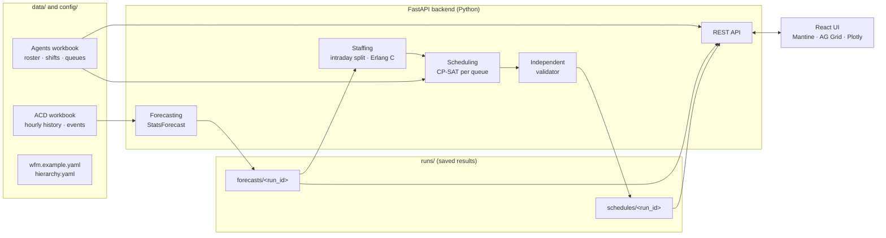

# Workforce Management - POC by Akkina

A proof of concept for contact-centre workforce management. It turns three months of queue
history into daily forecasts, converts those forecasts into 15-minute staffing requirements
with Erlang C, and assigns named agents to shifts with Google OR-Tools CP-SAT. The result is a
validated shift plan for every agent and day, and a browser UI for exploring it.

The repository includes synthetic input data and saved results, so the application runs
immediately after installation. Forecasts and schedules don't need to be regenerated.

- **Scale:** 1,000 agents in 30 queues, organised as 2 business units and 6 management units.
- **Horizon:** 21 days of forecasts and schedules (23 September – 13 October 2026) at 15-minute resolution.
- **Stack:** Python 3.14 (FastAPI, pandas, StatsForecast, OR-Tools) and React + TypeScript.
- **Scope and acceptance criteria:** see [PRD.md](PRD.md). Design decisions and findings are in [PLAN.md](PLAN.md).

> **Important:** Erlang C gives *approximate* interval staffing requirements, and CP-SAT
> optimises agent assignments *against* those requirements. A feasible schedule doesn't by
> itself prove that real-world service levels will be met.

---

## Contents

1. [Quick start](#quick-start)
2. [Sample data](#sample-data)
3. [Architecture](#architecture)
4. [How the system works](#how-the-system-works)
5. [Forecasting](#forecasting)
6. [Staffing requirements and Erlang C](#staffing-requirements-and-erlang-c)
7. [Schedule optimisation](#schedule-optimisation)
8. [Validation](#validation)
9. [Using the application](#using-the-application)
10. [Reading the Schedule tab](#reading-the-schedule-tab)
11. [Outputs](#outputs)
12. [Configuration](#configuration)
13. [Assumptions and limitations](#assumptions-and-limitations)
14. [Development](#development)

---

## Quick start

**Prerequisites:** Python 3.14 and Node.js 24.

```bash
git clone https://github.com/nakkina/wfm.git
cd wfm
make install     # creates backend/.venv and installs frontend packages
make dev         # backend on http://127.0.0.1:8000, frontend on http://localhost:5173
```

Open <http://localhost:5173>. The saved forecast and schedule runs in `runs/` are picked up
automatically:

- **Forecasts:** reused when the ACD workbook's fingerprint and the forecast settings match.
- **Schedule:** the latest completed schedule run is loaded.

---

## Sample data

All data is **synthetic**; both workbooks flag every record with `is_synthetic = True`. The
agent names are fictional.

| File | Contents |
|---|---|
| `data/wfm_agents_1000.xlsx` | **Agents:** 1,000 agents with home queue, skills, languages, work plan, contracted hours, allowed and preferred shifts, available days and preferred days off. **Shifts:** shift templates. **Queues:** opening hours and required skill per queue. **Dictionary:** a definition for every field. |
| `data/wfm_acd_hourly_2026-06-23_to_2026-09-22.xlsx` | **Queue hourly:** 92 days × 24 hours × 30 queues of ACD statistics (calls offered, answered, handled, abandoned; talk, hold and after-call work). **Events:** eight dated drivers such as holidays, an incident and campaigns. **Dictionary** and supporting sheets. |
| `config/hierarchy.yaml` | The business unit → management unit → queue hierarchy (2 → 6 → 30). |

**Profile of the sample:**

- **Agents:** 827 full-time (40 paid hours a week) and 173 part-time (20 hours). All are active and schedulable, and every agent is qualified for their home queue.
- **Queues:** 20–46 agents each. Every queue is open 08:00–20:30, seven days a week (America/New_York), with base handle times of 300–840 seconds.
- **Shift templates:**

  | Plan | Early (s1) | Midday (s2) | Late (s3) | Paid time | Breaks |
  |---|---|---|---|---|---|
  | Full-time (WP-FT) | 08:00–16:30 | 10:00–18:30 | 12:00–20:30 | 8 h | two paid 15-min breaks (+2:00, +6:15) and an unpaid 30-min meal (+4:00) |
  | Part-time (WP-PT) | 08:00–12:00 | 10:00–14:00 | 12:00–16:00 | 4 h | one paid 15-min break (+2:00) |

- **Work rules:** at least 11 hours' rest between shifts and at most 5 consecutive workdays.
- **Demand:** about 482,000 forecast calls over the 21-day horizon, or about 65,000 agent-hours of handling workload. The data has a clear weekly pattern and a midday peak.

---

## Architecture



| Layer | Technology | Responsibility |
|---|---|---|
| UI | React, TypeScript (strict), Vite, Mantine, TanStack Query, AG Grid Community, Plotly.js | Hierarchy navigation, agent tables, forecast charts, schedule views, run control |
| API | FastAPI, Pydantic | Reads inputs and saved runs; starts schedule runs; CSV export |
| Forecasting | StatsForecast | Daily volume and AHT forecasts with backtested model selection |
| Staffing | Python (no external solver) | Intraday allocation and Erlang C requirements |
| Optimisation | Google OR-Tools CP-SAT | Assigns agents to shift patterns per queue |
| Execution | Worker subprocess | One schedule run at a time; progress written to `status.json` |
| Storage | CSV and JSON files under `runs/` | Every run is saved with its settings, input fingerprints and timing |

There is no database, message queue or hosted service. The system runs locally for a single
user, as the PRD requires.

---

## How the system works

```
ACD history ──► daily forecast ──► 15-min demand ──► Erlang C ──► on-phone requirement
   (hourly)       (21 days)         (per queue)                      (per interval)
                                                                          │
agent roster + shift templates + work rules ──────────────────────────────┤
                                                                          ▼
                                   CP-SAT (per queue) ──► shift plans ──► validation ──► UI
```

1. **Forecast:** daily call volume and average handle time (AHT) are forecast for each queue.
2. **Distribute:** each day's forecast is spread across 15-minute intervals, using the queue's intraday pattern learned from history.
3. **Size:** Erlang C finds the fewest agents that meet the service-level and occupancy targets in each interval. An allowance for unplanned absence (residual shrinkage) is then added.
4. **Schedule:** CP-SAT chooses a shift, or a day off, for every agent and day. Each choice has fixed breaks and meal, and the solver minimises understaffing first, then excess, then preference violations.
5. **Validate:** an independent checker re-derives every hard rule from the raw inputs and the saved plan.
6. **Explore:** the UI shows requirements against scheduled coverage, shortages, the weekly plan and each agent's calendar.

---

## Forecasting

Forecasts run once for all queues and are saved to `runs/forecasts/<run_id>/`. A saved run is
reused as long as the ACD workbook, the forecast settings and the method version are
unchanged. Only then is a new run generated, in the background when the backend starts.

**Targets:**

- **Call volume:** daily sum of `calls_offered`.
- **AHT:** daily `handle_seconds ÷ calls_handled`, recomputed from totals. Hourly AHT values are never summed or averaged, as the ACD Dictionary requires.

**Event handling:** days listed in the Events sheet (holidays, an incident, campaigns) are
replaced *for training only* by the queue's median for that weekday. One-off shocks therefore
don't distort the models. These days are marked ✕ on the charts.

**Candidate models:** StatsForecast, with a weekly season of 7 days.

| Model | Description |
|---|---|
| Seasonal naive (**baseline**) | Same weekday last week |
| Same-weekday average | Mean of the same weekday over the last four weeks |
| AutoETS | Automatically selected exponential smoothing; may include a weekly season |
| AutoARIMA | Automatically selected ARIMA; captures short-term day-to-day persistence |

**Model selection:** each queue and target is back-tested over six rolling 21-day windows, one
week apart. Volume is scored by WAPE (total absolute error as a share of actual volume). AHT is
scored by mean absolute error weighted by handled calls. The baseline is kept unless another
model is strictly better.

**Prediction intervals:** the 80% and 95% bands are split-conformal intervals. They are built
from the chosen model's absolute back-test errors against raw actuals, including event days,
and pooled by forecast week, so later weeks can widen. They describe where actual daily values
are expected to fall.

**Why AHT forecasts can look flat:** in this data, the weekday pattern explains only a few
percent of daily AHT variation, and day-to-day carry-over fades within days. The best estimate
therefore settles near the queue's typical AHT, and the band carries the unpredictable
variation. A note under each chart reports these statistics.

---

## Staffing requirements and Erlang C

### From daily forecast to intervals

A daily forecast can't be staffed directly. The intraday profile gives each hour's share of
the day's calls, learned from history for each **queue × weekday × hour**, using normal days
only and normalised within opening hours. Each hour's calls are then split across its *open*
15-minute slots: equally by default, or using configured proportions. The 20:00 hour is open
for only 30 minutes, so its calls go into two slots.

Allocations are not rounded, and daily totals are preserved exactly. The allocated calls are
labelled as **estimated**. AHT is held constant within each day.

### Workload

For each interval of length *T* seconds (900 for 15 minutes):

```
workload_seconds     = forecast_calls × AHT_seconds
workload_agent_hours = workload_seconds / 3600
offered_load (A)     = workload_seconds / T              (Erlangs)
```

Workload agent-hours measure handling effort only. They aren't the hours to schedule, because
scheduling must also cover the service-level target and absence.

### Erlang C

Erlang C models a queue with Poisson arrivals, exponentially distributed handle times and *N*
agents. The probability that a call has to wait is computed with the numerically stable
Erlang B recurrence, which avoids factorials:

```
B(0) = 1
B(n) = A · B(n−1) / (n + A · B(n−1))                  for n = 1 … N
P(wait) = C(N, A) = N · B(N) / (N − A · (1 − B(N)))      (requires N > A)
```

The expected service level, meaning the share of calls answered within *t* seconds, is:

```
SL(N) = 1 − P(wait) · exp(−(N − A) · t / AHT)
```

The **required productive agents** *N* is the smallest integer greater than *A* that meets both:

- `SL(N) ≥ target` (default 80% answered within 20 seconds), and
- `A / N ≤ maximum occupancy` (default 85%).

**Residual shrinkage:** unplanned absence (default 10%) is applied once:

```
required_on_phone_agents = ceil(N / (1 − residual_shrinkage))
required_on_phone_hours  = required_on_phone_agents × interval_minutes / 60
```

Breaks, meals and leave are scheduled explicitly, so they are **not** counted in residual
shrinkage, and no extra occupancy factor is applied after Erlang C.

### Worked example (reference test)

| Input | Value |
|---|---|
| Calls | 120 per hour (30 per 15-minute interval) |
| AHT | 360 seconds |
| Offered load | 30 × 360 / 900 = **12 Erlangs** |
| Smallest *N* meeting 80/20 and ≤ 85% occupancy | **16 agents** |
| Expected service level at 16 agents | **83.62%** (15 agents give less than 80%) |
| Occupancy | 12 / 16 = **75%** |
| On-phone agents at 10% shrinkage | ceil(16 / 0.9) = **18** |

### Closing work

Calls admitted just before closing are still being handled afterwards. For a configurable
period after close (15 minutes by default), the model requires `ceil(A)` agents, where *A* is
the offered load of the last open interval. That's the average number of agents busy at
closing. These **closing** intervals are separate rows. No shift template ends after 20:30, so
this demand shows up as **shortage** rather than being dropped.

### Reporting rules

Agent-hours are summed across intervals. Concurrent agent counts are only ever reported as
**peaks**; they are never summed across time and presented as headcount.

---

## Schedule optimisation

### Model

Each queue is solved as its own CP-SAT model. Agents only ever work in their home queue, so no
constraint links two queues.

**Decision variables:** `x[agent, date, pattern] ∈ {0, 1}`. A *pattern* is a shift template on
a specific date with its breaks and meal placed on the 15-minute grid, forming a complete
timeline of On Phone, Paid Break and Unpaid Meal blocks. Patterns are precomputed. By default
they use the Shifts sheet's break times exactly; the optional *break stagger* lets each break
move ±15-minute steps within its placement window.

**Hard constraints:**

| Rule | Implementation |
|---|---|
| Eligibility | Active, schedulable agents in their home queue with the queue's required skill; ineligible agents are listed with a reason |
| Availability and leave | Only available days; never on leave days; only allowed shifts |
| One shift per day | At most one pattern per agent per local date |
| Weekly paid hours | Paid minutes per Monday–Sunday week within the agent's minimum and maximum; paid breaks count, unpaid meals don't; no overtime |
| Partial weeks | Bounds pro-rated by the agent's available days inside the horizon, rounded to whole shifts (for example 24–32 h in the 5-day first week) |
| Minimum rest | At least 11 hours between consecutive shifts, measured in UTC so daylight-saving changes are exact |
| Consecutive days | No more than five working days in any six-day window, including across week boundaries |
| Coverage | `scheduled_on_phone + shortage − excess = required_on_phone` in every interval |

Coverage is a *soft* constraint through explicit shortage and excess variables. Insufficient
capacity is therefore reported as visible shortage instead of making the model infeasible.

**Sequential objectives:** each stage is bounded by the best result of the previous one.

1. **Shortage:** minimise understaffed agent-minutes.
2. **Excess and paid time:** minimise excess coverage and avoidable paid minutes.
3. **Preferences and fairness:** minimise weighted penalties for:
   - missing the preferred shift;
   - working a preferred day off;
   - uneven weekends and late shifts within an employment type;
   - changes of shift start between consecutive workdays.

A stage stopped by its time limit keeps its best solution, reported as **Feasible**. A queue is
reported as **Optimal** only when CP-SAT proves every stage optimal. Agent names, demographics
and performance scores are never used as inputs.

### Results on the sample data

| Metric | Result |
|---|---|
| Solve time, all 30 queues | ~8 minutes |
| Stage 1 (shortage) | Proven optimal in all 30 queues (median 0.9 s) |
| Stage 2 (excess and paid time) | Proven optimal in all 30 queues |
| Stage 3 (preferences) | 3 queues optimal, 27 feasible at the 15 s limit |
| Plan | 1,000 agents × 21 days; 15,795 working shifts |
| Coverage | 107,122 required on-phone hours; 108,248 scheduled; 11,658 shortage agent-hours (557 after close) |

Most of the shortage is structural. Shifts start only at 08:00, 10:00 or 12:00, and everyone on
a shift takes breaks at the same times, while weekly demand slightly exceeds roster capacity.
Allowing breaks to move ±15 minutes reduced shortage by 16% on one queue, at about nine times
the solve time (see [PLAN.md](PLAN.md)).

---

## Validation

After solving, `wfm/validate/schedule.py` checks the saved plan against the raw roster, the
Shifts sheet and the requirements. It deliberately doesn't import the optimiser's code, so a
modelling error can't hide itself. It checks:

- **Completeness:** exactly one status per agent per day.
- **Placement:** home queue only; allowed shifts; available days; no work on leave.
- **Timelines:** activities are contiguous, on the grid, and span exactly the shift.
- **Paid time:** paid and unpaid minutes add up, and match the template's paid hours.
- **Breaks and meal:** counts, lengths and placement.
- **Weekly rules:** weekly paid-hour bounds, including partial weeks.
- **Rest and runs:** minimum rest and consecutive-day limits.
- **Coverage:** a recount of scheduled on-phone agents per interval from the activities.

A run is marked failed if any check fails. The report is saved as `validation.json`.

---

## Using the application

- **Organisation tree (left):** business unit → management unit → queue, with agent counts summed up from each queue. Selecting a business unit or management unit shows schedule totals for its children and a reconciled total row.
- **Agents tab:** the queue's roster in a configurable grid. You can choose any of the 68 dictionary fields and drag columns to reorder them. Clicking an agent ID opens their calendar.
- **Forecasts tab:** daily history and the 21-day forecast for volume and AHT, with 80% and 95% bands, event markers and model diagnostics. The chart toolbar provides linked zoom, selection summaries, and PNG and CSV export.
- **Schedule tab:** described in the next section.
- **Generate schedule (header):** starts a new run with editable service level, occupancy, shrinkage, closing allowance, break stagger and stage time limits. Progress is shown per queue, and the badge reports the outcome: *complete*, *complete with shortages*, *failed* or *stale* (inputs changed since the run).
- **Agent calendar:** a weekly view with previous and next week navigation. Working, Off and Leave days are shown distinctly, along with shift, break and meal times, weekly paid hours and preferred-shift matches.

---

## Reading the Schedule tab

**1. Status bar**

- **Solver badge:** *Optimal*, *Feasible*, *Infeasible* or *Unknown*. Hover it to see each stage's status, objective value, best bound and solve time. A gap between objective and bound means that stage wasn't proven optimal.
- **Hard rules validated:** confirms the independent validator passed.
- **Stale:** appears when the roster or ACD file has changed since the run.
- **CSV exports:** the queue's shift plans and activity details.

**2. Summary cards:** totals for the whole horizon.

| Card | Meaning |
|---|---|
| Required on-phone hours | Sum of interval requirements (Erlang C plus shrinkage, plus closing work) |
| Scheduled on-phone hours | Agent time on the phone in the plan; breaks and meals excluded |
| Shortage agent-hours | Required minus scheduled, summed over intervals where coverage falls short (red when above zero) |
| Excess agent-hours | Scheduled minus required, where coverage exceeds need |
| Scheduled paid hours | Paid time of all working shifts, including paid breaks |
| Peak required on phone | Highest single-interval requirement. This is a peak, not a headcount |
| Shifts / agents | Working shifts in the horizon, and agents in the queue |

**3. Week and day selectors:** choose the Monday–Sunday week, then the day. Partial weeks at
the edges of the horizon show only their in-horizon days.

**4. Required vs scheduled chart:** 15-minute intervals for the selected day.

- **Dotted line:** required on-phone agents.
- **Blue line:** scheduled on-phone agents.
- **Red bars:** shortage, labelled with the number of agents missing (for example −5).
- **Shaded band:** *after close* (finishing work).

Dips in the blue line at common break and meal times are expected when breaks aren't staggered.

**5. Weekly shift plan:** one row per agent with each day's shift code and times, for example
`s2 10:00–18:30`.

- **Off** and **Leave** days are labelled and shaded.
- **Grey cells** fall outside the horizon.
- **Paid h:** the agent's paid hours for the week.
- **Pref. shift:** how many working days use the agent's preferred shift.

Click an agent to open their calendar.

**6. Daily timeline:** one row per working agent on the selected day, ordered by start time.
Blocks are colour-coded and lettered: **P** On Phone, **B** Paid Break, **M** Unpaid Meal,
**L** Leave. The letters mean the timeline reads correctly without colour.

---

## Outputs

Each schedule run is saved under `runs/schedules/<run_id>/`. All timestamps are
timezone-aware ISO 8601.

| File | Contents |
|---|---|
| `requirements.csv` | Per queue and interval: offered calls, AHT, workload agent-hours, Erlangs, required productive agents, expected service level, occupancy, required on-phone agents and hours, allocation label |
| `coverage.csv` | Required vs scheduled on-phone agents, shortage and excess per interval |
| `shifts.csv` | Every agent × date: Working / Off / Leave / Unscheduled, shift code and times, paid and unpaid minutes, preference flags, run ID |
| `activities.csv` | Contiguous activities of every working shift: On Phone (with queue), Paid Break, Unpaid Meal, Leave |
| `validation.json` | Violation count per rule, with examples |
| `meta.json` | Settings, input fingerprints, per-queue and per-stage solver status, objective and bound, timings, shortages, conflicts, assumptions, package versions |
| `status.json` | Run state and progress (read by the UI) |

Forecast runs under `runs/forecasts/<run_id>/` contain `points.csv` (forecasts and interval
bounds), `scores.csv` (back-test score of every candidate), `diagnostics.csv`, `history.csv`
and `meta.json`.

---

## Configuration

All settings live in `config/wfm.example.yaml`. For local changes, copy it to
`config/wfm.yaml` (which git ignores) and set `WFM_CONFIG_PATH=config/wfm.yaml` in `.env`.

| Section | Key settings (defaults) |
|---|---|
| `paths` | Hierarchy, agents workbook, ACD workbook, `runs` directory |
| `forecast` | `horizon_days: 21`, `levels: [80, 95]`, `cv_windows: 6`, `cv_step_days: 7` |
| `staffing` | `interval_minutes: 15`, `service_level_target: 0.80`, `answer_threshold_seconds: 20`, `max_occupancy: 0.85`, `residual_shrinkage: 0.10`, `closing_minutes: 15`, `within_hour_proportions: null` |
| `scheduling` | `break_stagger_slots: 0`, `stage_time_limit_seconds: [20, 15, 15]`, `num_workers: 8`, `leave_csv: null`, preference `weights` |

The staffing targets, closing allowance, break stagger and stage limits can also be changed
for a single run from the **Generate schedule** form.

---

## Assumptions and limitations

- **Synthetic data:** the ACD workbook was generated with known seasonality, events and noise; results on real data will differ.
- **Short history:** three months can't reveal annual seasonality or holiday effects, and no future event calendar is available.
- **Erlang C:** it ignores abandonment and assumes a stationary interval, so service levels are modelled estimates.
- **AHT within the day:** held constant; intraday calls are an estimated allocation of the daily forecast.
- **Horizon start:** no prior schedule history exists, so agents are assumed rested at the start.
- **Intraday availability:** the roster has no time windows, so agents can take any shift they're allowed.
- **Leave:** none is supplied. A leave file can be configured, and paid leave then credits contracted daily hours.
- **Work rules:** these are configurable POC policies, not statements of labour law.
- **Closing work:** it can't be covered by the current templates and is reported as shortage.
- **Not implemented yet:** the PRD's first-fit baseline schedule and the baseline-vs-optimised comparison.

---

## Development

| Command | What it does |
|---|---|
| `make install` | Create the Python virtual environment and install frontend packages |
| `make dev` | Run the backend (port 8000, auto-reload) and frontend (port 5173) |
| `make lint` | ruff + oxlint |
| `make typecheck` | mypy (strict) + tsc |
| `make test` | pytest + vitest |
| `make check` | lint, typecheck and test |

Tests cover the Erlang C reference case, interval allocation, shift patterns (including
daylight-saving days), every hard rule, validation, end-to-end runs through the API and the UI
helpers. The backend tests use synthetic fixtures only.

```
wfm/
├── PRD.md, PLAN.md          requirements; design decisions and findings
├── config/                  settings and organisation hierarchy
├── data/                    input workbooks (synthetic)
├── runs/                    saved forecast and schedule runs
├── backend/
│   ├── src/wfm/
│   │   ├── api/             FastAPI app and schedule endpoints
│   │   ├── io/              workbook readers and validation
│   │   ├── forecast/        StatsForecast pipeline and run storage
│   │   ├── staffing/        intraday allocation, Erlang C, requirements
│   │   ├── schedule/        inputs, patterns, CP-SAT model, plan output, run worker
│   │   └── validate/        independent schedule validator
│   └── tests/
└── frontend/src/
    ├── api/                 typed API clients
    └── components/          tree, tables, charts, schedule views, calendars
```
